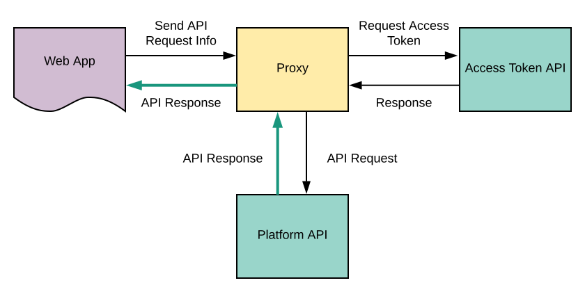

# Brightcove Learning Services: Sample Proxy Apps

The Brightcove Platform APIs are generally not CORS-enabled, meaning that you cannot access them directly from a web app like the ones that we in Brightcove Learning services create as examples for you to learn from: [Platform API Code Samples](https://support.brightcove.com/platform-api-code-samples).

To get around this, all you need to do is route the API requests through a server-side app often called a proxy. The proxy takes the request and other information sent from a web page via JavaScript, gets an access token, makes the API request, and then returns the response to the calling page.

For a more detailed look at using a proxy in this way see [Using the REST APIs](https://support.brightcove.com/learning-guide-using-rest-apis).

This repository currently contains one sample proxy, written in PHP, and modeled closely on the one we use for sample apps.

Overtime, we will add more sample proxies in other languages. If there is a language you would particularly like to see, please <a href="mailto:docs@brightcove.com">let us know</a> and we will prioritize accordingly.

## Using the sample proxy

1. Clone or download the repository
2. Copy the file bcls-proxy-for-distribution.php to a web server that supports PHP
3.
